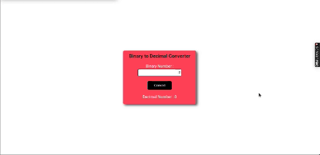

# JavaScript Binary to decimal converter

- This is Javascript mini-Project. In this project I have made a **Binary to decimal converter** with JavasCript, which converts binary number to decimal number.

- It took me 2-3 hrs to make this project.

  

---

## 🛠 Skills learned

- JavaScript
- To Use DOM
- Creating Elements in Javascript
- Adding Elements in HTML using JavaScript
- Adding Attributes to the Elements

---

## 🎥 Working

---

## 🚀 About Me

### Hey, I am Yasir lambawala

- I am born and brought up in Vadodara, Gujarat. I have done my Btech at GTU university and I am currently learning Web-development.

---

## Feedback

- If you have any feedback, please reach me at lambawalay@gmail.com
